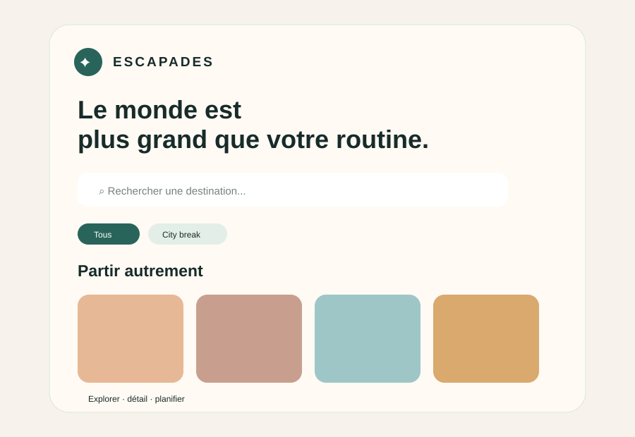
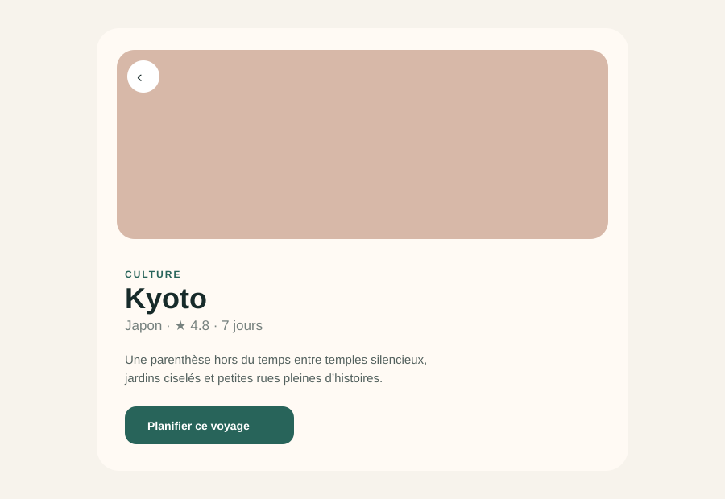
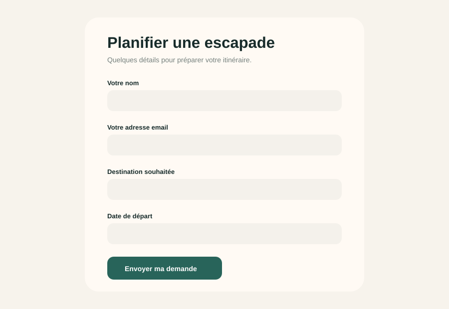
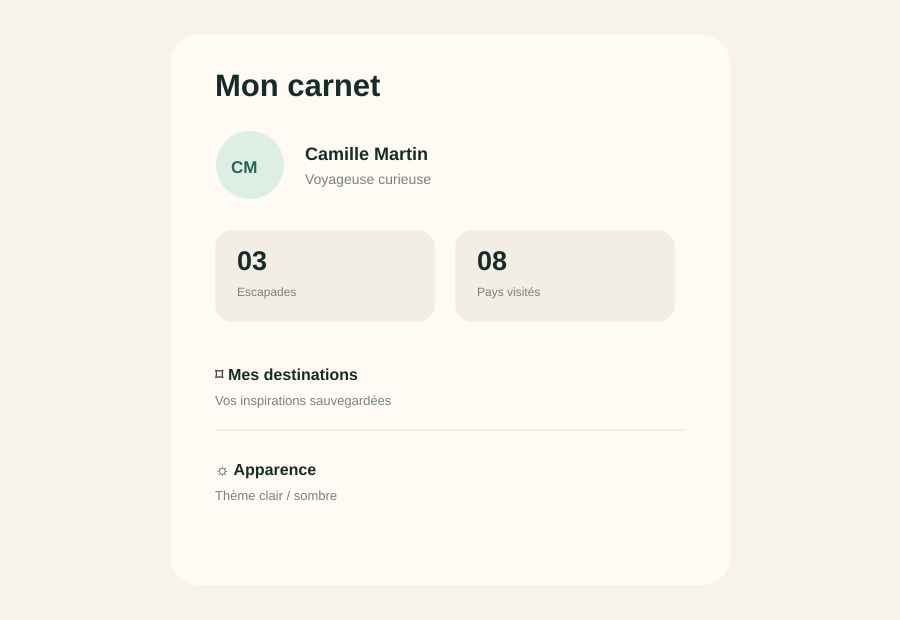

# Escapades — projet de certification Flutter

Application de découverte de voyages construite avec Flutter. Elle propose une expérience multi-écrans pour explorer des destinations, ouvrir un détail complet, préparer une demande de voyage et gérer ses préférences d’affichage.

La note détaillée destinée au reviewer est disponible dans [`REVIEWER_NOTE.md`](REVIEWER_NOTE.md).

## Lancer le projet

Pré-requis : Flutter 3.22+ et Dart 3.4+.

```bash
flutter pub get
flutter run
```

Validation :

```bash
flutter analyze
flutter test
flutter run -d chrome
```

Si le dépôt est cloné sans les dossiers de plateforme générés, initialiser les cibles locales une seule fois :

```bash
flutter create .
```

Cette commande conserve `lib/`, `assets/`, `test/` et `pubspec.yaml` et génère les projets Android, iOS, Web, macOS, Linux et Windows.

## Parcours de démonstration

1. Depuis **Explorer**, attendre le chargement asynchrone des destinations.
2. Rechercher « Japon » ou choisir la catégorie **Nature**.
3. Ouvrir une carte : la route nommée `/destination/:id` transmet l’identifiant et la destination à l’écran de détail.
4. Appuyer sur **Planifier ce voyage** pour rejoindre le formulaire.
5. Tester la validation des champs nom, email, destination et date.
6. Ouvrir **Mon carnet** et basculer le thème clair/sombre.
7. Redimensionner la fenêtre ou utiliser une tablette : la grille passe de 2 à 3 puis 4 colonnes.

## Architecture

```text
lib/
├── core/
│   ├── router/app_router.dart       # GoRouter + routes nommées
│   └── theme/app_theme.dart         # Thèmes clair et sombre
├── data/
│   ├── models/                      # Destination et Profile
│   └── repositories/                # Lecture du JSON local
├── presentation/
│   ├── providers/                   # État Riverpod
│   ├── screens/                     # Explorer, détail, planifier, profil
│   └── widgets/                     # Composants réutilisables
└── main.dart
```

Les données des destinations sont dans `assets/destinations.json`. Les widgets reçoivent des modèles ou des providers : les destinations, prix, catégories et informations du profil ne sont pas définis dans la présentation.

## Providers

| Provider | Responsabilité |
|---|---|
| `destinationRepositoryProvider` | Expose le repository de données |
| `destinationsProvider` | Charge les destinations avec `FutureProvider` |
| `searchQueryProvider` | Stocke la recherche en cours |
| `selectedCategoryProvider` | Stocke la catégorie active |
| `categoriesProvider` | Dérive les catégories du catalogue |
| `filteredDestinationsProvider` | Dérive la liste filtrée |
| `themeModeProvider` | Contrôle le thème clair/sombre |
| `savedTripsProvider` | Compte les demandes de voyage mock |
| `profileProvider` | Fournit les données du profil mock |

## Exigences couvertes

- **4 écrans distincts** : Explorer, Détail, Planifier, Mon carnet.
- **Navigation nommée** : GoRouter avec `home`, `destination`, `plan` et `profile`.
- **Paramètres de détail** : `/destination/:id` reçoit un `pathParameter` et un objet `extra`.
- **Recherche et filtrage** : champ de recherche, catégories et liste dérivée.
- **Formulaire validé** : nom, email, destination, date de départ et notes.
- **Thème clair/sombre** : `ThemeModeNotifier` et deux `ThemeData`.
- **Widgets Flutter variés** : `CustomScrollView`, `SliverAppBar`, `GridView`, `ListView` via `ListTile`, `Stack`, `Card`, `Hero`, `ChoiceChip`, `Form`, `TextFormField`, `DropdownButtonFormField`, `NavigationBar`, `LayoutBuilder`, `Wrap` et `SnackBar`.
- **Widgets réutilisables** : `DestinationCard`, `ResponsiveDestinationGrid`, `RemoteImage` et `SectionTitle` dans `lib/presentation/widgets/`.
- **Responsive** : 2 colonnes sur mobile, 3 sur tablette et 4 sur grand écran.
- **Séparation données/UI** : catalogue JSON, modèles, repository et providers séparés des écrans.

## Captures d’écran

Les aperçus des écrans livrés sont disponibles dans le dossier [`screenshots/`](screenshots/) :

| Explorer | Détail | Planifier | Profil |
|---|---|---|---|
|  |  |  |  |
